<!-- GitHub Stats (다크/라이트 모드 대응) -->
<picture decoding="async" loading="lazy">
  <source media="(prefers-color-scheme: dark)" srcset="https://pixel-profile.vercel.app/api/github-stats?username=tmuchal&screen_effect=true&theme=fuji&dithering=true">
  <source media="(prefers-color-scheme: light)" srcset="https://pixel-profile.vercel.app/api/github-stats?username=tmuchal&screen_effect=false&theme=road_trip&dithering=true">
  
</picture>

 

<!-- Pixel IT Profile Card (다크/라이트 모드 대응) -->
<picture decoding="async" loading="lazy">
  <source media="(prefers-color-scheme: dark)" srcset="./profile-cyberpunk.svg">
  <source media="(prefers-color-scheme: light)" srcset="./profile-matrix.svg">
  
</picture>

 

<!-- Pixel Cat Room -->
<picture decoding="async" loading="lazy">
  <source media="(prefers-color-scheme: dark)" srcset="./cat-cyberpunk.svg">
  <source media="(prefers-color-scheme: light)" srcset="./cat-matrix.svg">
  
</picture>

